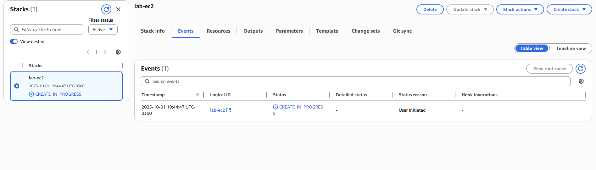

# 🚀 Desafio AWS CloudFormation – DIO

---

## 📌 Objetivo do Desafio

- Aplicar os conceitos de **Infraestrutura como Código (IaC)** com AWS CloudFormation.
- Criar e gerenciar **stacks** através de templates em YAML/JSON.
- Documentar de forma clara os processos, aprendizados e boas práticas.
- Utilizar o **GitHub** para versionar e compartilhar a documentação técnica.

---

## 🛠️ Tecnologias e Serviços Utilizados

- **AWS CloudFormation** → criação e gerenciamento de infraestrutura.
- **Amazon EC2** (instâncias de teste).
- **Amazon S3** (armazenamento de templates).

---

## 📝 Passos Realizados

1. **Estudo dos conceitos**  
   Revisei os fundamentos de **CloudFormation**, entendendo como funcionam stacks, templates e recursos declarativos.

2. **Criação do Template**

   - Estruturei um arquivo YAML definindo recursos como **EC2**, **Security Groups** e **S3 Bucket**.
   - Validei o template no console da AWS.

3. **Deploy da Stack**

   - Subi o template no **CloudFormation**.
   - Acompanhei a criação dos recursos.
   - Validei que a infraestrutura foi provisionada conforme o código.

4. **Documentação**
   - Registrei os aprendizados.
   - Organizei este repositório para servir como material de apoio em futuras práticas.

---

## 📸 Evidências

Exemplo de criação de stack no console da AWS:

---

## ✨ Principais Aprendizados

- **IaC (Infraestrutura como Código)**: CloudFormation permite descrever toda a infraestrutura em arquivos declarativos.
- **Reprodutibilidade**: uma vez criado, o template pode ser reutilizado em outros ambientes.
- **Automação**: elimina a necessidade de criar recursos manualmente.
- **Controle de mudanças**: fácil atualização e rollback de stacks.

---

## 📚 Recursos de Apoio

- [Exemplos de Templates AWS](https://docs.aws.amazon.com/AWSCloudFormation/latest/UserGuide/sample-templates-services-us-west-2.html)
