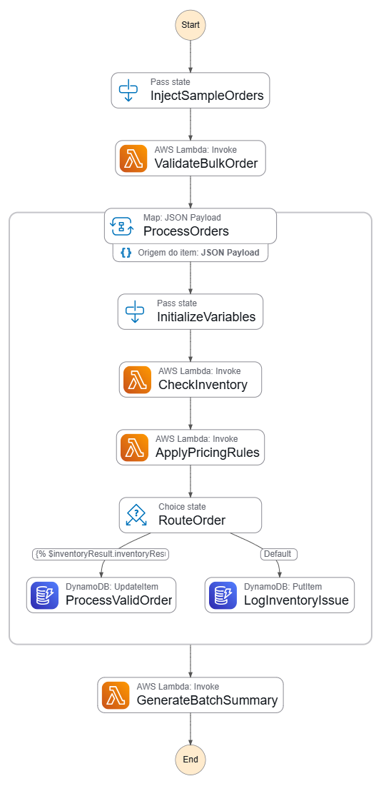

# ☁️ AWS Cloud Foundations

## 📌 Sobre o Repositório

Este repositório reúne anotações e conceitos fundamentais sobre alguns serviços essenciais da **AWS (Amazon Web Services)**, servindo como material de apoio para estudos e consultas futuras.

---

## 🌍 Conceitos Fundamentais da AWS

### 🔹 Regiões (Regions)

- Conjuntos de data centers localizados em áreas geográficas distintas.
- Cada região é independente das outras, garantindo **tolerância a falhas** e **estabilidade**.
- Exemplo: `us-east-1` (Norte da Virgínia), `sa-east-1` (São Paulo).

### 🔹 Zonas de Disponibilidade (Availability Zones - AZs)

- Subdivisões dentro de uma região.
- Cada AZ é composta por um ou mais data centers fisicamente separados.
- Permitem **alta disponibilidade** e **tolerância a falhas**.

### 🔹 Serviços da AWS

- A AWS oferece serviços em diferentes categorias:
  - **Computação** → EC2, Lambda, ECS.
  - **Armazenamento** → S3, EBS, EFS.
  - **Banco de Dados** → RDS, DynamoDB.
  - **Rede e Segurança** → VPC, Route 53, IAM.
  - **Ferramentas de Gerenciamento** → CloudWatch, CloudFormation.

---

## ☁️ Modelos de Serviços em Nuvem

### 🔹 IaaS (Infrastructure as a Service)

- Fornece **infraestrutura básica de TI** sob demanda: servidores, rede, armazenamento e máquinas virtuais.
- O usuário é responsável por configurar o sistema operacional, aplicações e dados.
- Exemplo na AWS: **Amazon EC2, Amazon EBS, Amazon VPC**.
- Ideal para quem deseja **flexibilidade total**, controlando desde o SO até as aplicações.

### 🔹 PaaS (Platform as a Service)

- Fornece um **ambiente pronto para desenvolvimento e execução de aplicações**.
- O provedor gerencia a infraestrutura e o sistema operacional, enquanto o usuário foca apenas na aplicação.
- Exemplo na AWS: **Elastic Beanstalk, AWS Lambda (serverless)**.
- Ideal para desenvolvedores que querem **rapidez no deploy** sem se preocupar com servidores.

### 🔹 SaaS (Software as a Service)

- Fornece **aplicações prontas** via internet, sem necessidade de instalação ou manutenção pelo usuário.
- O provedor gerencia **tudo**: infraestrutura, plataforma e software.
- Exemplos: **Amazon WorkMail, Dropbox, Google Workspace**.
- Ideal para uso direto de softwares com **zero preocupação com backend ou infraestrutura**.

---

## 🖥️ Amazon EC2 (Elastic Compute Cloud)

- Serviço de computação em nuvem que permite criar e gerenciar **máquinas virtuais (instâncias)**.
- Principais características:
  - Escalabilidade sob demanda.
  - Pagamento por uso.
  - Diferentes **tipos de instância** (otimizadas para CPU, memória, armazenamento, etc.).
  - Controle de rede e segurança via **Security Groups** e **VPCs**.

---

## 📦 Amazon S3 (Simple Storage Service)

- Serviço de armazenamento de objetos altamente escalável e durável.
- Casos de uso:
  - Backup e recuperação.
  - Hospedagem de sites estáticos.
  - Armazenamento de logs e dados de análise.
- Estrutura:
  - **Buckets**: "pastas" principais de armazenamento.
  - **Objects**: arquivos/dados dentro dos buckets.
  - **Keys**: identificadores únicos de cada objeto.

---

## 💾 Amazon EBS (Elastic Block Store)

- Serviço de **armazenamento em blocos** utilizado em conjunto com instâncias EC2.
- Funciona como um **HD/SSD virtual** anexado à instância.
- Tipos:
  - **gp3/gp2**: uso geral (SSD).
  - **io2/io1**: alta performance (SSD).
  - **st1/sc1**: otimizados para throughput (HDD).
- Persistência: o volume EBS pode ser **desanexado** de uma instância e **reatribuído** a outra.

---

## 📀 Amazon Machine Image (AMI)

- Imagem que contém o **sistema operacional** e as **configurações iniciais** de uma instância EC2.
- Permite criar várias instâncias padronizadas a partir de uma mesma base.
- Tipos de AMIs:
  - AWS fornecidas.
  - Criadas pelo usuário (customizadas).
  - Disponíveis em marketplaces.

---

## 🔄 Snapshots EBS

- **Backup pontual** de volumes EBS.
- Armazenados no **S3** de forma incremental (otimizando custo).
- Utilizados para:
  - Restaurar volumes EBS.
  - Criar novas AMIs.
  - Migração de dados entre regiões.

---

## 🧩 AWS Step Functions

### O que são

- Serviço da AWS para **orquestração de workflows** através de máquinas de estado.
- Permite coordenação de múltiplas tarefas, serviços e funções de forma visual e declarativa.

### Componentes principais

- **State Machine**: definição do fluxo de estados (Tasks, Parallel, Choice, Wait, Succeed, Fail etc).
- **Estados (States)**: cada passo da execução — tarefa, paralelismo, decisão, espera, finalização etc.
- **Transições**: caminhos entre estados com base em condições ou saídas.
- **Retry / Catch**: tratamento de falhas — você pode definir tentativas automáticas ou caminhos alternativos.
- **Input / Output**: cada estado pode receber dados de entrada e manipular saída, passando para o próximo estado.
- **Integrations**: conecta com Lambda, SNS, SQS, DynamoDB, ECS, APIs, etc.

### Vantagens

- Separação da lógica de orquestração do código principal.
- Robustez com tratamento de erros e fallback.
- Monitoramento nativo via AWS.
- Escalabilidade automática e sem servidor (serverless).
- Custos proporcionais ao uso (por transição de estado).

### Exemplo de workflow

A imagem abaixo mostra um exemplo de orquestração de processamento de pedidos:



- Validação inicial em lote (Lambda).
- Processamento item a item com estado **Map**.
- Verificação de inventário.
- Aplicação de regras de preço.
- Decisão condicional (**Choice**) para pedidos válidos ou com falha.
- Registro em tabelas do DynamoDB.
- Geração de resumo final.

# 🏗️ AWS CloudFormation

## 📌 O que é o CloudFormation?

O **AWS CloudFormation** é um serviço que permite implementar **Infraestrutura como Código (IaC)**.  
Com ele, você descreve os recursos de nuvem (EC2, S3, VPCs, IAM, etc.) em **templates** no formato **YAML ou JSON**, e a AWS se encarrega de criar e gerenciar esses recursos de forma automatizada.

---

## 🎯 Vantagens do CloudFormation

- **Automação**: elimina a criação manual de recursos.
- **Reprodutibilidade**: o mesmo template pode ser usado em múltiplos ambientes (dev, teste, produção).
- **Controle de mudanças**: suporta atualização de stacks e rollback automático em caso de falhas.
- **Escalabilidade**: fácil replicação de arquiteturas completas.
- **Padronização**: garante consistência no provisionamento da infraestrutura.

---

## 🔑 Conceitos-Chave

- **Template**: arquivo YAML/JSON que descreve os recursos.
- **Stack**: conjunto de recursos criados a partir de um template.
- **Resources**: definição dos serviços AWS a serem provisionados.
- **Parameters**: valores de entrada para tornar o template mais flexível.
- **Outputs**: informações de saída (ex.: IP público da instância criada).
- **Change Sets**: pré-visualização de alterações antes de aplicá-las na stack.

---

## 📂 Estrutura do Repositório

```
.
├── README.md          # Documentação principal (teoria)
├── Cloudformation.md  # Documentação sobre criação de stack
├── templates/         # Arquivos YAML/JSON de exemplo de templates.
    └── ec2-basic.yaml
└── images/            # Diagramas ilustrativos
    ├── DesafioEBS.png
    ├── DesafioS3.png
    └── stepfunctions_graph.png

```

---

## 📚 Referências

- [AWS EC2 Documentation](https://docs.aws.amazon.com/ec2/)
- [AWS S3 Documentation](https://docs.aws.amazon.com/s3/)
- [AWS EBS Documentation](https://docs.aws.amazon.com/ebs/)
- [AWS Step Functions Documentation](https://docs.aws.amazon.com/step-functions/)
- [AWS CloudFormation](https://docs.aws.amazon.com/cloudformation/)
